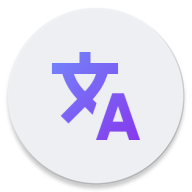

  
  <h1>Translate You</h1>
  
Translate You is a Translator App built with <a href="https://m3.material.io/">Material Design 3 (You)</a> using the <a href="https://github.com/LibreTranslate/LibreTranslate">LibreTranslate API</a>.

  

    
    
    
    
    
     

## Features

- [x] 30 supported languages
- [x] Material Design 3 (You)
- [x] Dark and light theme
- [x] Entirely Open Source

## Download

## Contribution

All contributions are welcome!
Feel free to suggest new features or new APIs that could be supported.
If you are a developer and wish to contribute to the app, please to fork the project and submit a pull request.

## License

Translate You is licensed under the [GNU General Public License](https://www.gnu.org/licenses/gpl.html): You can use, study and share it as you want.
