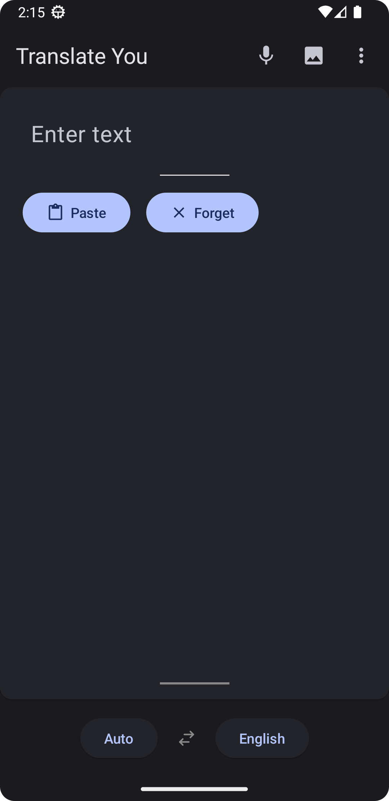
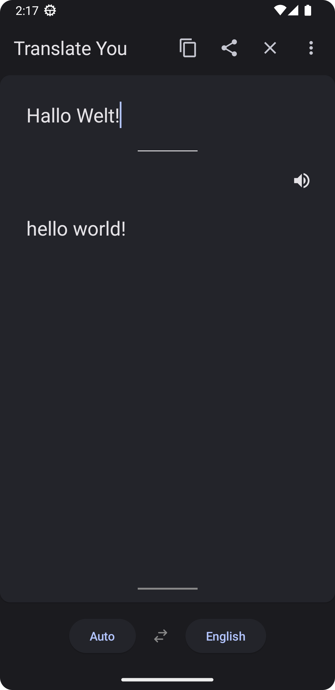
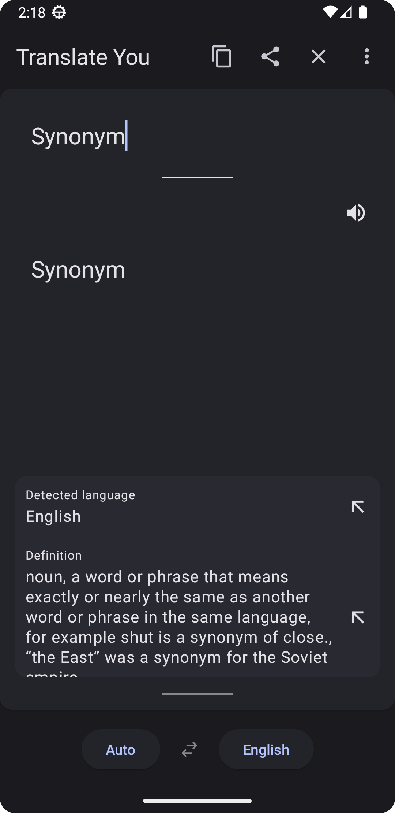
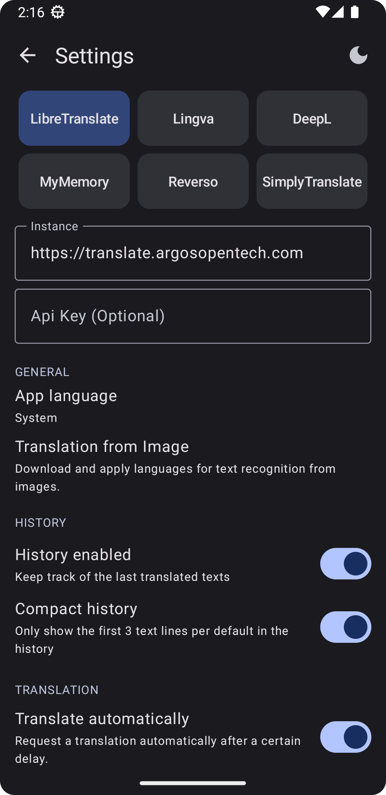
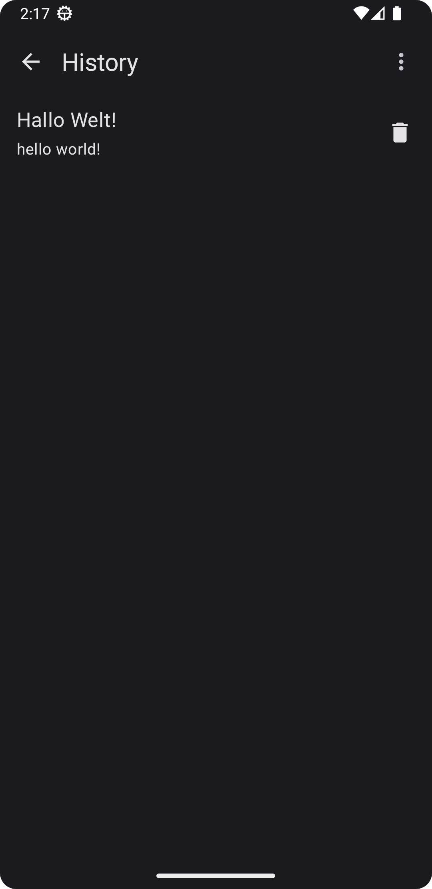
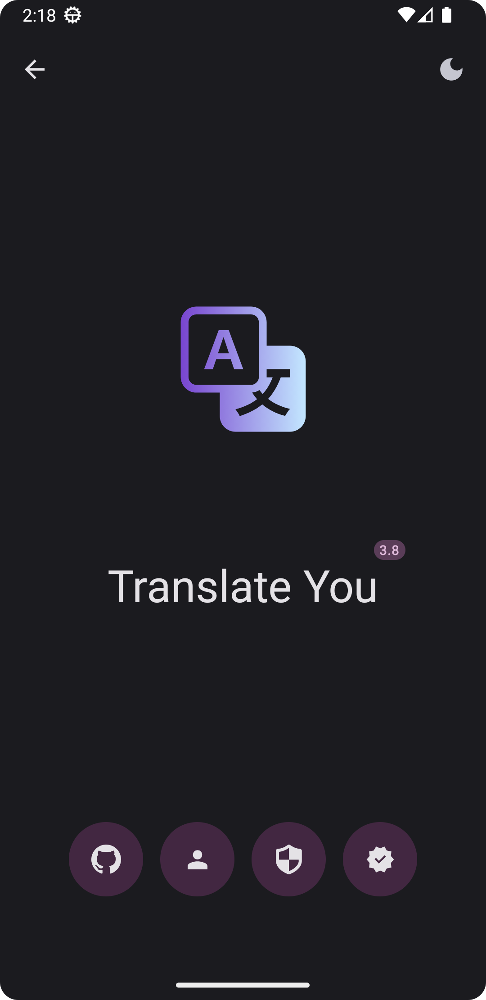

<!-- ---------- Header ---------- -->

  
  <h1>Translate You</h1>

Powerful Translator App built with <a href="https://m3.material.io/">Material Design 3 (You)</a> supporting different translation engines.

<!-- ---------- Badges ---------- -->
  

    
    
    
    
    
     

<!-- ---------- Description ---------- -->
## Features

- [x] more than 150 supported languages
- [x] 9 different translation engines
- [x] Material Design 3 (You)
- [x] Dark and light theme
- [x] Support for Android sharing system
- [x] Multilingual interface
- [x] Translation from images
- [x] Translation history
- [x] Entirely Open Source
- [X] Written in Jetpack Compose 

<!-- ---------- Download ---------- -->
## Download

<!-- ---------- Supported translation engines ---------- -->
## Supported translation engines

* <a href="https://github.com/LibreTranslate/LibreTranslate">LibreTranslate</a>
* <a href="https://github.com/thedaviddelta/lingva-translate">LingvaTranslate</a> _which uses Google Translate® to fetch translations._
* <a href="https://www.deepl.com/translator">Deepl translator®</a>.
* <a href="https://mymemory.translated.net/">MyMemory translator®</a>.
* <a href="https://simple-web.org/projects/simplytranslate.html">SimplyTranslate</a>
* <a href="https://www.reverso.net">Reverso®</a>
* <a href="https://translate.wmcloud.org">MinT</a>
* <a href="https://glosbe.com/">Glosbe</a>
* <a href="https://apertium.org/">Apertium</a>

<!-- ---------- Screenshots [Plus version] ---------- -->
## Screenshots

  
  
  
  
  
  

<!-- ---------- Contribution ---------- -->
## Feedback and contributions
***All contributions are very welcome!***

* Feel free to join the [Matrix room](https://matrix.to/#/#you-apps:matrix.org) for discussions about the app.
* Bug reports and feature requests can be submitted [here](https://github.com/you-apps/TranslateYou/issues) (please make sure to fill out all the requested information properly!).
* If you are a developer and wish to contribute to the app, please **fork** the project and submit a [**pull request**](https://help.github.com/articles/about-pull-requests/).

## Translation

**Translations are greatly appreciated.** \
If **Translate You** is not in your language, feel free to participate by:
* Translating the application interface, via [**pull request**](https://help.github.com/articles/about-pull-requests/) or more simply by [**Weblate**](https://hosted.weblate.org/projects/you-apps/translate-you/).
* **Check** and **update** the [**pre-existing translations on Github**](https://github.com/you-apps/TranslateYou/tree/master/app/src/main/res) or more simply via [**Weblate**](https://hosted.weblate.org/projects/you-apps/translate-you/).

<!-- ---------- Privacy Policy and License ---------- -->
## Privacy Policy

**Translate You's privacy policy is available** [**here**](https://github.com/you-apps/TranslateYou/blob/master/PRIVACY%20POLICY.md)

## Credits
* Icon design by [M00NJ](https://github.com/M00NJ)

## License

Translate You is licensed under the [**GNU General Public License**](https://www.gnu.org/licenses/gpl.html): You can use, study and share it as you want.
